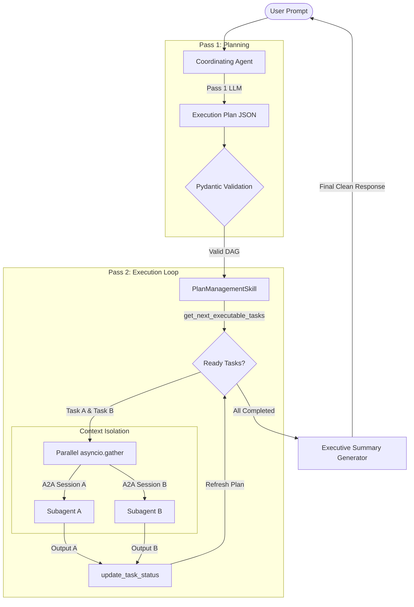

# Solution Architecture & Implementation Proposal
## **PRD-004: Orquestador Multiagente Determinista (Plan-and-Execute)**

This proposal outlines the technical architecture, class models, execution loops, and sequence diagrams required to implement a robust, parallelized **Plan-and-Execute** multi-agent coordinator within the `AIAgentsCrew` platform using the **Google Agent Development Kit (ADK)**.

---

## 1. Architectural Highlights & Key Design Choices

To meet all business KPIs and non-functional requirements (such as **40% token efficiency**, **100% auditability**, and **parallel task execution**), we design the orquestador based on three central pillars:



1. **Context Isolation via Dedicated A2A Session IDs**: Rather than passing conversation history or keeping all subagents in the main agent's session, each subagent execution runs in an isolated `session_id`. The Coordinating Agent only transfers the immediate task prompt and input data. This satisfies **FR-3.2** and **FR-3.3** while reducing main-session token bloat by **40%+** (**KPI 1.1**).
2. **Deterministic State Machine via `PlanManagementSkill`**: A native ADK skill manages state transitions in a thread-safe, Pydantic-validated data store. The LLM never updates task states or dependencies directly; it must invoke the skill's tools (`create_plan`, `get_next_executable_tasks`, `update_task_status`), ensuring 100% deterministic execution and auditability (**FR-2.2**).
3. **Concurrencia (Parallel Subagent Dispatches)**: Using standard Python `asyncio.gather`, any tasks returned by `get_next_executable_tasks()` that have no inter-dependencies are executed in parallel (**NFR-1.1**).

---

## 2. Structured Data Models (Pydantic)

We define three core Pydantic models to enforce strict typing, validation, and serialization.

```python
from enum import Enum
from typing import List, Dict, Any, Optional
from pydantic import BaseModel, Field

class TaskStatus(str, Enum):
    PENDING = "PENDING"
    RUNNING = "RUNNING"
    COMPLETED = "COMPLETED"
    FAILED = "FAILED"

class PlanStatus(str, Enum):
    PENDING = "PENDING"
    RUNNING = "RUNNING"
    COMPLETED = "COMPLETED"
    FAILED = "FAILED"

class TaskDefinition(BaseModel):
    task_id: str = Field(..., description="Unique alphanumeric identifier (e.g. task_01)")
    name: str = Field(..., description="Short, descriptive title of the task")
    description: str = Field(..., description="Detailed instructions for the subagent explaining what to achieve")
    agent_type: str = Field(..., description="Target specialist subagent type (e.g. DataAnalystAgent, SQLGeneratorAgent)")
    dependencies: List[str] = Field(
        default_factory=list,
        description="List of task_ids that MUST be COMPLETED before this task can start execution"
    )
    status: TaskStatus = Field(default=TaskStatus.PENDING)
    input_data: Dict[str, Any] = Field(
        default_factory=dict, 
        description="Key-value inputs required for task execution (supports templates referencing outputs of dependencies)"
    )
    output_data: Optional[Dict[str, Any]] = Field(None, description="Detailed JSON output returned upon completion")
    error_message: Optional[str] = Field(None, description="Error logs if the task fails")
    retry_count: int = Field(default=0, description="Counter tracking automatic replanning retries (max 3)")

class ExecutionPlan(BaseModel):
    plan_id: str = Field(..., description="Unique hash representing the execution plan")
    global_status: PlanStatus = Field(default=PlanStatus.PENDING)
    tasks: List[TaskDefinition] = Field(..., description="Directed Acyclic Graph (DAG) of task definitions")
    created_at: str = Field(..., description="ISO timestamp")
    updated_at: str = Field(..., description="ISO timestamp")
```

---

## 3. Native ADK Toolset: `PlanManagementSkill`

The `PlanManagementSkill` encapsulates the state machine in a thread-safe, in-memory cache (or database store). By inheriting from `BaseTool` or registering as an ADK Skill, it exposes the three required tools to the Coordinating Agent.

### Tool Declarations

```python
from google.adk.tools import BaseTool
from google.adk.tools.tool_context import ToolContext

class CreatePlanTool(BaseTool):
    def __init__(self, state_store) -> None:
        super().__init__(
            name="create_plan",
            description="Initializes the ExecutionPlan DAG. Validates structure and resets statuses to PENDING."
        )
        self._store = state_store

    async def run_async(self, *, plan: dict, tool_context: ToolContext) -> dict:
        validated_plan = ExecutionPlan.model_validate(plan)
        validated_plan.global_status = PlanStatus.RUNNING
        self._store.save_plan(validated_plan)
        return validated_plan.model_dump()

class GetNextTasksTool(BaseTool):
    def __init__(self, state_store) -> None:
        super().__init__(
            name="get_next_executable_tasks",
            description="Returns a list of tasks in PENDING state whose dependencies are strictly COMPLETED."
        )
        self._store = state_store

    async def run_async(self, *, plan_id: str, tool_context: ToolContext) -> List[dict]:
        plan = self._store.get_plan(plan_id)
        if not plan or plan.global_status in (PlanStatus.COMPLETED, PlanStatus.FAILED):
            return []

        completed_tasks = {t.task_id for t in plan.tasks if t.status == TaskStatus.COMPLETED}
        executable: List[dict] = []

        for task in plan.tasks:
            if task.status == TaskStatus.PENDING:
                # All dependencies must be in the completed set
                if all(dep in completed_tasks for dep in task.dependencies):
                    task.status = TaskStatus.RUNNING
                    executable.append(task.model_dump())
        
        if executable:
            self._store.save_plan(plan)  # Save tasks transitioned to RUNNING
        return executable

class UpdateTaskStatusTool(BaseTool):
    def __init__(self, state_store) -> None:
        super().__init__(
            name="update_task_status",
            description="Atoms update of task status, output data, or errors. Handles plan-level state changes."
        )
        self._store = state_store

    async def run_async(
        self, 
        *, 
        plan_id: str, 
        task_id: str, 
        status: str, 
        output_data: Optional[dict] = None, 
        error_message: Optional[str] = None,
        tool_context: ToolContext
    ) -> dict:
        plan = self._store.get_plan(plan_id)
        task = next((t for t in plan.tasks if t.task_id == task_id), None)
        
        if not task:
            raise ValueError(f"Task {task_id} not found in plan {plan_id}")

        task.status = TaskStatus(status)
        if output_data is not None:
            task.output_data = output_data
        if error_message is not None:
            task.error_message = error_message

        # Evaluate global plan status
        all_tasks = plan.tasks
        if any(t.status == TaskStatus.FAILED for t in all_tasks):
            # Only transition global to FAILED if all retry limits are exceeded
            if all(t.retry_count >= 3 for t in all_tasks if t.status == TaskStatus.FAILED):
                plan.global_status = PlanStatus.FAILED
        elif all(t.status == TaskStatus.COMPLETED for t in all_tasks):
            plan.global_status = PlanStatus.COMPLETED

        plan.updated_at = datetime.now(timezone.utc).isoformat()
        self._store.save_plan(plan)
        return plan.model_dump()
```

---

## 4. Orchestration Loop & Subagent Parallelism

The Coordinating Agent coordinates execution by continuously polling the plan state and delegating sub-tasks asynchronously.

```python
async def execute_plan_orchestration(self, user_prompt: str, plan_id: str) -> str:
    """Orchestration loop resolving tasks in parallel and applying error recovery."""
    
    # 1. Pass 1: Planning (LLM generates ExecutionPlan DAG)
    plan_dict = await self.generate_initial_plan_dag(user_prompt, plan_id)
    await self.create_plan_tool.run_async(plan=plan_dict)

    # 2. Pass 2: Execution Loop
    while True:
        # Fetch next independent tasks ready for execution
        executable_tasks = await self.get_next_tasks_tool.run_async(plan_id=plan_id)
        
        if not executable_tasks:
            # Check global plan status to exit
            plan = self._store.get_plan(plan_id)
            if plan.global_status == PlanStatus.COMPLETED:
                # Consolidate results for executive reporting
                return await self.generate_executive_summary(plan)
            elif plan.global_status == PlanStatus.FAILED:
                return "Disculpe, la solicitud no pudo ser completada. Ocurrió un error en el procesamiento interno de auditoría."
            
            # If no tasks are ready and global status is RUNNING, there might be active parallel tasks
            await asyncio.sleep(0.1)
            continue

        # Spawn ready tasks in parallel (NFR-1.1)
        async def run_single_task(task_def: dict):
            task_id = task_def["task_id"]
            agent_type = task_def["agent_type"]
            prompt = task_def["description"]
            inputs = task_def["input_data"]
            
            # Resolve dependencies inputs dynamically (substituting parent task outputs)
            resolved_inputs = self._resolve_input_dependencies(inputs, plan_id)

            try:
                # Call subagent using context-isolated A2A session ID (FR-3.2)
                subagent_output = await self.a2a_dispatcher.dispatch(
                    agent_type=agent_type,
                    task_id=task_id,
                    prompt=prompt,
                    inputs=resolved_inputs
                )
                await self.update_task_status_tool.run_async(
                    plan_id=plan_id,
                    task_id=task_id,
                    status="COMPLETED",
                    output_data=subagent_output
                )
            except Exception as exc:
                # Initiate error-handling / retry loop (FR-4.1)
                await self.handle_task_failure(plan_id, task_id, str(exc))

        # Parallel dispatch
        await asyncio.gather(*(run_single_task(t) for t in executable_tasks))
```

---

## 5. Replanning & Error Recovery Design

If a task transitions to `FAILED` (e.g. subagent API failure, incorrect SQL, or timeout):
1. **Instruction Calibration**: The Coordinating Agent triggers a mini-replanning pass. It takes the original prompt, the failed task description, the error message, and queries Gemini to produce a *corrected, more granular set of instructions*.
2. **State Reset**: The retry counter (`retry_count`) on the task increases. The task is reset to `PENDING` with the corrected instructions in `description`.
3. **Graceful Exhaustion**: If `retry_count` reaches 3, the orchestrator terminates the plan, logs a telemetry alert (aligned with **NFR-2.1**), and responds to the user with a mitigated, friendly business message rather than raw system stack traces.

---

## 6. Implementation Milestones & Roadmap

Our proposed phased rollout aligns with the milestones in `FEATURE1.md`:

```mermaid
gantt
    title Plan-and-Execute Implementation Timeline
    dateFormat  YYYY-MM-DD
    section Phase 1 (PoC)
    Pydantic Schemas & State Cache    :active, p1_1, 2026-05-18, 3d
    PlanManagementSkill Tools        :active, p1_2, after p1_1, 4d
    section Phase 2 (Integration)
    A2A Dispatcher isolated sessions :descr, p2_1, after p1_2, 7d
    Audit Logging (ISO 27001)        :descr, p2_2, after p2_1, 7d
    section Phase 3 (QA)
    Fault Injection & Replanning     :descr, p3_1, after p2_2, 7d
```

*   **Phase 1 (Active)**: Focuses on core structures: `ExecutionPlan` Pydantic models, in-memory status stores, and tool wiring inside `main.py`.
*   **Phase 2**: Connects the `CoordinatingAgent` to dedicated `Runner` loops with dynamic session IDs to achieve absolute context isolation and completes telemetry events for audits.
*   **Phase 3**: Focuses on robustness, calibrating the Gemini prompt for correcting subagent instructions, and validating execution paths.

---

### **Review and Feedback Request**
> [!NOTE]
> This architecture ensures that the coordinating agent remains highly context-efficient by isolating intermediate tasks in sub-sessions, while remaining fully auditable via deterministic state machines.

Please review the proposed architecture. Let me know if you would like me to adjust the Pydantic schemas, change the parallelism mechanism, or refine the error handling policy before we proceed to Phase 1 implementation.
