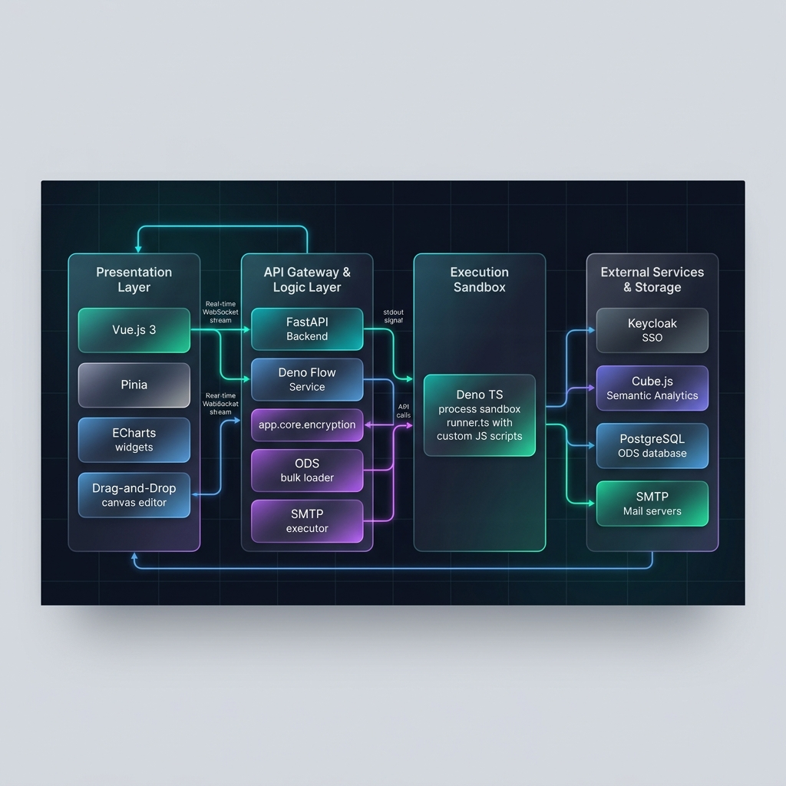

# 🏛️ Análisis de Arquitectura Global: DashboardStudio

Este documento detalla la **arquitectura técnica de DashboardStudio**, una solución híbrida empresarial de alto rendimiento diseñada para la **visualización interactiva de analítica avanzada (mediante CubeJS/ECharts)** y la **orquestación segura y delegada de flujos de integración (ETL/automatizaciones)**.

La arquitectura se ha diseñado bajo los principios de **desacoplamiento total, escalabilidad horizontal, seguridad sandboxed y reactividad en tiempo real**.

---

## 🖼️ Infografía de Arquitectura Premium (16:9 Horizontal para PPT)

La siguiente ilustración representa la arquitectura global de la solución de forma horizontal, ideal para ser integrada directamente en diapositivas de presentaciones corporativas o técnicas:

> [!NOTE]
> La imagen se encuentra guardada localmente en tu espacio de trabajo en: `design/images/dashboard_studio_architecture.png` para su fácil copiado y uso en PowerPoint.

---

## 🧭 Desglose por Capas Arquitectónicas

DashboardStudio está estructurado en **4 bloques o capas principales**, cada uno con responsabilidades y tecnologías bien delimitadas:

### 1. Capa de Presentación (Frontend)
El cliente es una aplicación web SPA rica, moderna e interactiva, diseñada para ofrecer una experiencia premium de usuario.
* **Framework Core:** **Vue.js 3** + **Vite** (para una compilación ultrarrápida y carga optimizada).
* **Gestión de Estado y Rutas:** **Pinia** (patrón modular de almacenamiento) y **Vue Router** para navegación fluida.
* **Diseñador de Dashboards (Drag-and-Drop):** Implementado mediante **vuedraggable** para permitir arrastrar y estructurar widgets visuales libremente.
* **Visualización de Datos:** Motores gráficos de **ECharts** (`vue-echarts`) que interactúan en tiempo real con el CubeJS Client para representar series complejas (Líneas, Barras, Sectores, etc.).
* **Explorador de Esquemas Analíticos:** Permite al diseñador explorar de forma dinámica las métricas (medidas) y dimensiones expuestas por CubeJS.
* **Editor de Código Enbebido:** **Vue Monaco Editor** (el motor de VS Code) para escribir scripts personalizados de transformación de datos directamente desde el navegador.
* **Seguridad y Autenticación:** **Keycloak-js** integrado con flujo OIDC y tokens PKCE seguros.

---

### 2. Capa de API Gateway y Lógica de Negocio (Backend)
Un servicio asíncrono y robusto construido en Python que centraliza la lógica empresarial, la seguridad y la delegación de ejecuciones complejas.
* **Servicio Base:** **FastAPI** ejecutándose sobre un servidor ASGI asíncrono (**Uvicorn**).
* **Gestor de Flujos en Deno (`deno_service`):** Controla el ciclo de vida del subproceso Deno. Utiliza `run_in_executor` para evitar el bloqueo del bucle de eventos (`SelectorEventLoop`) de Windows en entornos de desarrollo local.
* **Ejecutores de Tareas Pesadas (Delegación):**
  * **`ods_executor` (PostgreSQL Batch Loader):** Utiliza la librería nativa asíncrona de alto rendimiento `asyncpg` para realizar inserciones, actualizaciones y upserts masivos en lotes optimizados hacia bases de datos de destino.
  * **`email_executor` (Envío SMTP Seguro):** Cifra y desencripta credenciales de servidores de correo usando criptografía simétrica (Fernet via `app.core.encryption`), sanitiza correos con la biblioteca de seguridad `nh3` y procesa plantillas dinámicas dinámicamente con **Jinja2**.
* **Base de Datos de Metadatos:** PostgreSQL (o base de datos SQL relacional local) gestionada mediante **SQLAlchemy ORM** y control de esquema evolutivo con **Alembic**.
* **Federación de Identidades:** Middleware de autenticación y autorización conectado con **Keycloak** para validar tokens JWT en cada petición HTTP.

---

### 3. Entorno de Ejecución Seguro (Sandbox)
La solución cuenta con un procesador ligero para ejecutar de forma aislada y segura scripts de código dinámico.
* **Tecnología:** **Deno / TypeScript** (ejecutando `runner.ts`).
* **Sandbox Aislado:** Deno se inicia con restricciones de hardware y seguridad específicas (`--allow-read`, `--allow-net`, `--allow-env` acotados, y limitación de memoria V8 `--max-old-space-size=256`).
* **Transformación Ligera:** Ejecuta de forma segura scripts arbitrarios proporcionados por el usuario para formatear datos, mapear llaves o procesar lógica de bifurcación condicional.
* **Modelo de Señales de Control:** Cuando el Runner de Deno identifica un nodo pesado (como ODS o Envío de Correo), detiene la ejecución local y emite una señal estructurada a través de su salida estándar (`stdout`) (`EXEC_ODS:`, `EXEC_EMAIL:`). El backend de FastAPI intercepta estas señales, ejecuta la acción con credenciales seguras y devuelve la respuesta.

---

### 4. Capa de Servicios Externos y Almacenamiento
* **Cube.js Analytics:** Actúa como la capa semántica y de caché analítica entre las bases de datos transaccionales/DWs y el frontend, optimizando las queries SQL de los dashboards.
* **Keycloak IAM:** Centraliza la autenticación, roles de visualizador/diseñador, y políticas corporativas de accesos.
* **Destino ODS (PostgreSQL):** Base de datos relacional operativa donde se cargan los datos refinados por los flujos.
* **Servidores SMTP:** Relay de correo (como Gmail SMTP seguro) para notificaciones automatizadas.

---

## 🔄 El Modelo de Ejecución Delegada e Híbrida

Este modelo híbrido resuelve de manera elegante los siguientes retos arquitectónicos:
1. **Seguridad:** El frontend o los scripts de usuario (Deno) nunca tocan ni conocen contraseñas de bases de datos de producción ni del SMTP corporativo. FastAPI desencripta las credenciales en memoria en el último segundo.
2. **Rendimiento:** Deno maneja la orquestación ligera de flujos rápidamente, mientras que Python (vía `asyncpg` y `ods_executor`) procesa escrituras masivas en paralelo de forma óptima.
3. **Monitoreo en Vivo:** A través de WebSockets, cada evento de log del motor de Deno y de los ejecutores de Python se transmite instantáneamente al canvas de Vue.js, dando retroalimentación visual inmediata.

```mermaid
sequenceDiagram
    autonumber
    actor Diseñador
    participant Canvas as Frontend Vue.js
    participant API as FastAPI Backend (Python)
    participant Deno as Deno Sandbox (runner.ts)
    participant DB as PostgreSQL (Target ODS)
    participant SMTP as SMTP Relay

    Diseñador->>Canvas: Clic en "Ejecutar Flujo"
    Canvas->>API: Suscribe a WebSocket log stream
    API->>Deno: Lanza proceso "deno run" pasándole la definición en JSON
    
    loop Proceso de Flujo en Sandbox
        Deno->>Deno: Ejecuta scripts lógicos JS (JS Script Nodes)
        Deno->>API: Imprime señal en stdout: EXEC_ODS / EXEC_EMAIL con ID
    end

    rect rgb(18, 24, 38)
        note right of API: Interceptación y Delegación en Backend
        API->>API: Captura stdout y parsea el payload del evento
        API->>API: Desencripta credenciales de forma segura
        
        alt Nodo es ODS PostgreSQL
            API->>DB: Bulk Upsert/Insert asíncrono con asyncpg (ods_executor)
        else Nodo es EMail (SMTP)
            API->>API: Renderiza cuerpo HTML (Jinja2) y sanitiza (nh3)
            API->>SMTP: Envía correo TLS seguro
        end
        
        API->>Canvas: Envía estatus y logs formateados vía WebSocket
    end

    Deno->>API: Finalización de ejecución (Código 0 / 1)
    API->>Canvas: Cierra stream WebSocket con reporte de éxito o error
    Canvas->>Diseñador: Muestra reporte final y marca nodos en verde/rojo
```

---

## 🎯 Beneficios y Propuesta de Valor de esta Arquitectura

* **Escalabilidad Elástica:** Los runners de Deno pueden ejecutarse como contenedores independientes o procesos efímeros y ligeros, consumiendo apenas ~20MB a ~40MB de RAM.
* **Seguridad de Nivel Financiero:** Aislamiento total de scripts customizados y cifrado simétrico robusto de credenciales en reposo.
* **Alineación Corporativa:** Diseñado de forma horizontal para una presentación ejecutiva de TI, demostrando una clara separación de responsabilidades y flujos de datos auditables.
