# Arquitectura de la Solución: Ejecución Delegada de Flujos

Esta solución implementa un **modelo híbrido de ejecución segura y de alto rendimiento**, desacoplando el diseño del flujo de su procesamiento pesado y de la interacción con los servicios externos.

---

## 🖼️ Infografía de Arquitectura Premium

---

## 🔄 Diagrama de Flujo y Secuencia (Mermaid)

El siguiente diagrama ilustra cómo se delega la ejecución de los nodos pesados (ODS PostgreSQL, SMTP EMail y Webhooks) desde el entorno ligero de Deno de vuelta al backend de Python:

```mermaid
sequenceDiagram
    autonumber
    actor Usuario
    participant Frontend as Frontend Vue.js
    participant API as FastAPI Backend (Python)
    participant Deno as Deno Flow Runner (TypeScript)
    participant PG as PostgreSQL (silver/bronze)
    participant SMTP as SMTP GMail Server

    Usuario->>Frontend: Clic en "Ejecutar Flujo"
    Frontend->>API: Conexión WebSocket log stream
    API->>Deno: Lanza runner.ts con definición de flujo
    
    rect rgb(30, 41, 59)
        note right of Deno: Fase de Ejecución Deno
        Deno->>Deno: Procesa lógica nativa y JavaScript (JS Nodes)
        Deno->>API: Stream: EXEC_ODS / EXEC_EMAIL / EXEC_REST
    end

    rect rgb(15, 23, 42)
        note right of API: Fase de Delegación en Python
        API->>API: Intercepta logs del Stream
        API->>API: Desencripta credenciales (app.core.encryption)
        
        alt Nodo es ODS PostgreSQL
            API->>PG: Realiza inserciones/upserts en lotes (ods_executor)
        else Nodo es EMail (SMTP)
            API->>API: Aplica wrapping de records a Jinja2
            API->>SMTP: Envía correo seguro (SMTP_SSL en port 465 / STARTTLS)
        end
        
        API->>Frontend: Transmite estatus detallado (WebSocket)
    end

    API->>Frontend: Cierre del Stream (Éxito/Error)
    Frontend->>Usuario: Muestra reporte en el FlowCanvas
```

---

## 🛠️ Componentes Clave de la Solución

1. **Frontend Flow Editor (Vue.js):** Lienzo interactivo donde se diseñan las rutas de integración de datos y se visualizan los logs de ejecución en tiempo real mediante WebSockets.
2. **Deno Sandbox (`runner.ts`):** Entorno de ejecución ultra rápido y seguro para el flujo. Realiza operaciones de paso, transformación y ejecución de scripts personalizados de JavaScript de forma aislada.
3. **Python Backend Executors (FastAPI):**
   * **`deno_service`:** Gestiona el ciclo de vida del subproceso Deno y parsea su stream en vivo de logs de salida.
   * **`ods_executor`:** Controla la base de datos PostgreSQL mediante cargadores por lote altamente optimizados.
   * **`email_executor`:** Gestiona el servidor SMTP (GMail), administrando de forma segura las credenciales cifradas y renderizando plantillas con Jinja2 en conjunto con sanitización nh3.
