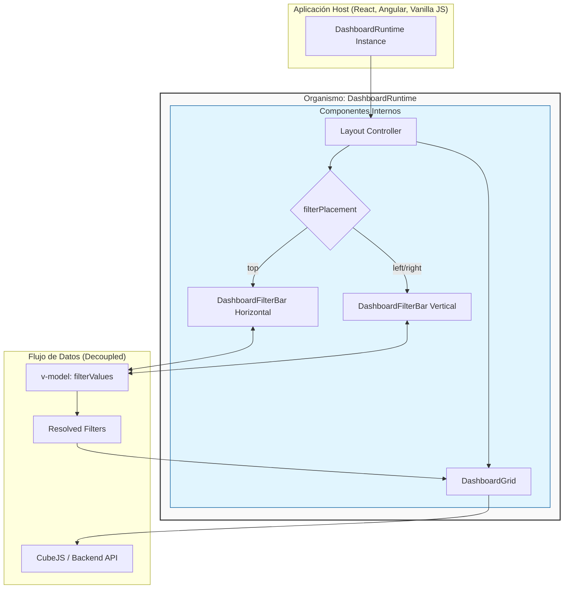

# Organismo: DashboardRuntime

## Arquitectura de Componentes

## Propósito
El `DashboardRuntime` es un componente de alto nivel (organismo) diseñado estrictamente para orquestar la visualización y filtrado de widgets. Su responsabilidad se limita a la interacción entre los datos y los filtros aplicados, delegando los controles administrativos (título, descripción, gestión de widgets, IA) a la aplicación host o vista contenedora.

## Decisiones Arquitecturales

### 1. Delimitación de Responsabilidades (Pure Rendering)
- **Organismo**: Contiene exclusivamente la barra de filtros y la rejilla de widgets.
- **Host (App)**: Gestiona la barra de herramientas superior (Toolbar), la edición de metadatos (nombre/descripción) y los disparadores de configuración.
- **Beneficio**: Esto permite que el organismo sea extremadamente ligero y fácil de embeber en contextos donde no se desea permitir la edición (ej: un portal de cliente externo) sin modificar el componente.

### 2. Desacoplamiento de Estado (Dependency Injection)
- **Problema**: Los componentes originales dependían directamente de Pinia stores (`useDashboardStore`, `useCubeStore`), lo que impedía su uso fuera de la aplicación principal.
- **Solución**: El organismo recibe los datos necesarios (`widgets`, `filters`, `palette`) y el estado de los filtros (`filterValues`) como props. Esto permite que el componente sea "puro" y agnóstico de dónde vienen los datos.

### 3. Layout Flexible (Multi-Position Filters)
- **Implementación**: Se utiliza una prop `filterPlacement` con valores `'top'`, `'left'`, o `'right'`.
- **CSS Strategy**: 
    - Uso de `flex-direction` (`column` para top, `row` para left, `row-reverse` para right).
    - Adaptación visual del `DashboardFilterBar` mediante la clase `.is-vertical`, cambiando el flujo de los filtros de horizontal (wrap) a vertical (stack).
- **Z-Index Management**: Los dropdowns de los filtros tienen un `z-index` superior para asegurar que se superpongan correctamente sobre la rejilla de widgets en cualquier posición.

### 4. Seguridad y Embebido
Se han definido tres rutas para la exposición de este organismo:
- **Web Components**: Exportación vía `defineCustomElement` de Vue para integración nativa en React/Angular/JS.
- **iFrame Bridge**: Uso de una ruta dedicada con políticas de `frame-ancestors` restrictivas y comunicación vía `postMessage`.
- **JWT Authorizer**: El organismo espera un token de acceso que el backend valida específicamente para el `dashboardId` solicitado, garantizando autorización a nivel de recurso.

## Estructura del Componente

### Props (API)
| Prop | Tipo | Descripción |
| :--- | :--- | :--- |
| `dashboardId` | `String` | Identificador único del dashboard. |
| `widgets` | `Array` | Lista de widgets configurados. |
| `filters` | `Array` | Esquema de filtros definidos para el dashboard. |
| `filterValues` | `Object` | (v-model) Valores actuales seleccionados en los filtros. |
| `filterPlacement`| `String` | Ubicación de la barra de filtros: `top`, `left`, `right`. |
| `isDesignMode` | `Boolean` | Habilita/deshabilita interacciones de edición dentro de la rejilla. |

### Eventos
- `update:filterValues`: Emitido cuando cambia cualquier filtro.
- `refresh`: Emitido cuando se solicita una actualización manual o por intervalo.
- `configure-widget`: Burbujeo del evento de edición de un widget.
- `layout-widget`: Burbujeo del evento de cambio de tamaño/posición.
- `remove-widget`: Burbujeo del evento de eliminación.

## Próximos Pasos
1. **Tema Dinámico**: Implementar una prop `theme` para inyectar variables CSS desde la aplicación host.
2. **PostMessage API**: Estandarizar el contrato de mensajes para el modo iFrame (ej: `SET_FILTERS`, `RESIZE_FRAME`).
3. **Lazy Loading**: Asegurar que los componentes de gráficos (ECharts) se carguen solo cuando el organismo sea montado.
